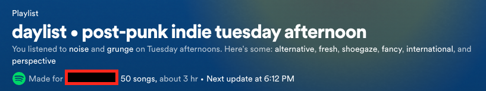

# Spotify Playlist Syncbot

The goal of this project was to build a tool for keeping a running archive of playlists that change on a regular basis. For instance, this program can be used to make sure that all of the songs from a Discover Weekly playlist (which is updated every week), is stored in another playlist that acts as an archive. Additional functionality has been added to create a daily archive playlist of all Spotify Daylists generated for a user in one day, and generate a written log of all automated transfers made.

## Types of Syncs

### Daylist Sync (New):

The Spotify Daylist is a new feature that has gained a lot of popularity on social media, but is also unknown to many users. The Daylist is a playlist that is owned and created by Spotify, but “made for” a particular user. The uri for this playlist does not change, but throughout the day) about every 3-4 hours, the _name_, _description,_ and _tracks_ update.

The 50 songs within this playlist are based on what the user it is generated for typically listens to during a particular time of day. Example ⇒



Details:

1. This job is currently ran every two hours.
2. The job looks at settings set in the DAYLIST object in the `transfers.py` file.
3. If `sync_on` is `True`, the current daylist information for the name, description, and track uris is retrieved. The daylist acts as the `from_playlist`.
4. A new playlist is created on each day, with about 3 - 5 different versions of the daylist being added to it.
   1. The name of these playlists are formatted to be “YY/MM/DD DAYLIST ARCHIVE”, so that they can be easily organized by the user, and easily found by the program.
   2. Before syncing, the script first checks if there is an existing daylist archive for that day. If one exists, that is used as the _to_playlist_. If an archive for that day does not exist, a new playlist with the formatted name is created, and acts as the to_playlist.
5. If new songs are present, songs are then transferred from the _from_playlist_ to the _to_playlist_, with almost the same process as the general sync.
6. When a Daylist Archive is Updated, the description is also updated to include how many songs have been added, and what the title of the daylist at the time was.
7. The `sync_log.txt` is also updated with detailed information of the sync performed.

### General Sync

1. Loops through an array of “transfers” that will be done each time the script is ran.
   1. Each transfer object includes the _from_playlist_, and a _to_playlist_.
   2. During a transfer, all the _new_ songs contained in the _from_playlist_, will be moved to the _to_playlist_.
   3. Any songs in the _from_playlist_ that already exist in the _to_playlist_ will be skipped.
   4. If songs are added, then the description of the _to_playlist_ will be changed to display the last updated date, and the source of the content.
   5. When new songs are present and transferred, the `sync_log.txt` file is updated
   6. If no new songs are added, the sync_log will not be updated.

### Other Features and Technology

1. The SpotiPy Python Library is used for SpotifyOAuth, and interaction with the Spotify Web API.
2. The Spotify Class Module provided by the spotiPy Library has been extended SpotifySession class, to provide custom methods:
   1. `get_playlist_track_uris`: given the playlist_id, this method fetches tracks in batches of 100, and returns an array of all of the track uris for a playlist.
   2. `search_playlists_by_name`: retrieves all of the current user’s private and public playlists, looks for a match between the query provided and the name of the playlist, and returns the playlist if a match is found.
   3. `add_tracks`: given the playlist_id, and an array of track_uris, this method adds tracks to a playlist in batches of 100, to avoid any limit errors from the spotify api.
   4. `prev_day_arhive_uris`: When the daylist sync is ran and an archive for that day already exists, duplicates are prevented from being added. However, since this job runs every 2 hours, it was likely that a daylist would be added to two days of archives. This method retrieves the uris from the previous Daylist Archive as well to prevent this issue.
3. TimeZone: In the `utils.py` file, the TimeZone is set to PST time in the datetime method, to ensure that the time displays correctly in the description of an Archive Playlist. _If a user needs to set a different timezone, this is where to change it_.
4. The main.js Python Script is ran as a cron job with Github Actions, and is currently set to run every _two hours_.
5. When Songs are transferred to a Daylist Archive, the description of the playlist updates to include a log of all of the daylists transfers that occurred on that day, including the generated title from the daylist at the time of transfer, and the transfer time. Example ⇒

   

6. After the `main.js` script is run, the `sync_log.txt` file is updated to include records of which playlists where updated during the job. The github actions have also been configured so that these changes are committed and saved when the script is ran through the github action workflow. EXAMPLE ⇒

   

### Usage and Installation

1. Fork this repo
2. Clone and spin up local environment (Mac OS):

```python
git clone {repository-url}
cd python-spotify-syncbot
python3 -m venv venv
source venv/bin/activate # activates virtual python environment
pip install -r requirements.txt # Installs required dependencies

cp .env-example .env # Duplicates .env-example and creates .env file to add your own variables
rm sync_log.txt # Removes the log, which will be recreated once main.js is ran successfully.
```

1. Go to the Spotify Developer Dashboard and log in with your Spotify account.
2. Click on the "Create an App" button and fill out the necessary information.
3. From the app dashboard, you'll find your client ID, client secret and Redirect URL. Copy this and paste it your `.env` file.
4. After the .env file is updated, run the script `get_refresh_token.py` to get refresh token. Follow the instruction in this script. Copy the refresh token into the `.env` file.
5. Before running the main.js script, update the `transfers.py` file:

   1. _THE TRANSFER WILL ONLY WORK IF YOU THE AUTHENTICATED USER IS THE OWNER OF THE TO_PLAYLIST._
   2. The from_playlist_name, and to_playlist_name will not impact the functionality and are only used for easy reference in the transfer file. The playlist names used in the log and script are retreived through the spotify api using the URI.
   3. To get the link for a playlist in spotify, click on the ellipses, go to share, and click on “Copy Link to Playlist.”
   4. Example:

   ```python
   TRANSFERS = [
   	{
   		"from_playlist_name": {name_of_source_playlist},
   		"from_playlist_link": {link_of_source_playlist},
   		"to_playlist_name": {playlist_name_to_store_archive},
   		"to_playlist_link": {playlist_link_to_store_archive},
   	}
   ]
   ```

6. To use the daylist, the `DAYLIST` object in `transfers.py`should also be updated with the url of the daylist that you would like to sync.
7. Since the daylist job will generate a new playlist every day in your profile everyday, this sync can be turned off by updating the transfers file and changing `sync_on` to `False`
8. Run the `main.js` script for local testing.
9. To set up github actions for this project so that the main.js script is ran on a cron job:
   1. Add all env variables as a github repository secret.
   2. To change the frequency of how often the script is ran, update the `cron: '0 2 * * *’` on line 5 of the `actions.yml`
   3. Look at [Cron Generator](https://crontab.guru/) for help with this syntax.
   4. NOTE: this file has been updated so that the actions are compatible with the newest version of github actions, which now runs on Node 20.

### Resources:

[Spotipy Documentation](https://github.com/spotipy-dev/spotipy/tree/master)

[Python Git Action Template for Reference](https://github.com/patrickloeber/python-github-action-template)

[Spotify for Developers](https://developer.spotify.com/)

[Spotify Daylist](https://newsroom.spotify.com/2023-09-12/ever-changing-playlist-daylist-music-for-all-day/)
